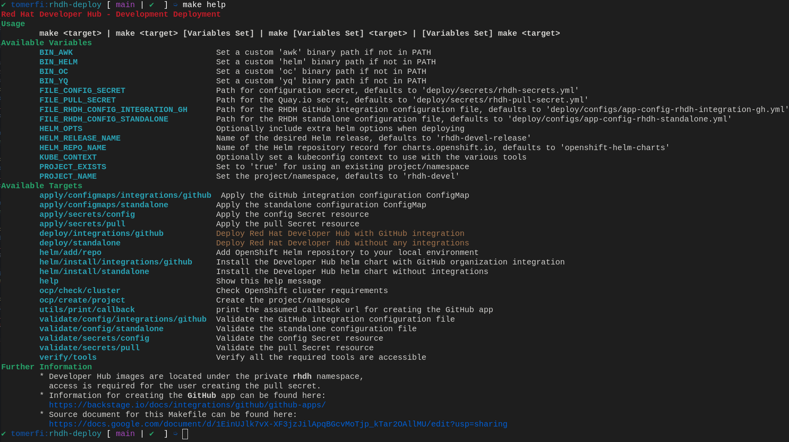

<h1>WIP</h1>
<h2>Deploy tool for Red Hat Developer Hub</h2>




### Deploy Backstage/Janus IDP using Openshift Template :

update the variables in MakeFile  

```
 GITHUB_ORGANIZATION  
 AUTH_GITHUB_CLIENT_ID 
 AUTH_GITHUB_CLIENT_SECRET 
 GITHUB_TOKEN
``` 
For deploying, run the command `make template/apply`. For cleaning up, run the command `make template/clean`.
